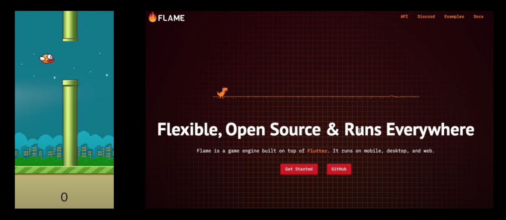

# 🐦 Flappy Bird Clone

Um clone do clássico jogo **Flappy Bird**, desenvolvido em **Flutter** utilizando o **Flame Engine**.  
Este projeto foi criado com o objetivo de estudar **desenvolvimento de jogos 2D** em Flutter e explorar os recursos oferecidos pelo Flame.  

---

## 📸 Capturas de tela

---

## 🚀 Tecnologias utilizadas
- [Flutter](https://flutter.dev/)  
- [Flame Engine](https://flame-engine.org/)  

---

## 🎮 Como jogar
- Toque na tela para fazer o pássaro voar.  
- Desvie dos canos para marcar pontos.  
- O jogo termina quando o pássaro colide com um cano ou com o chão.  

